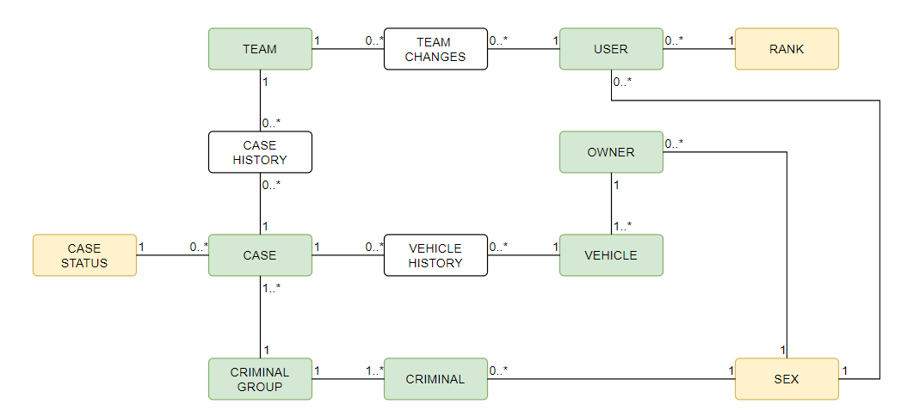
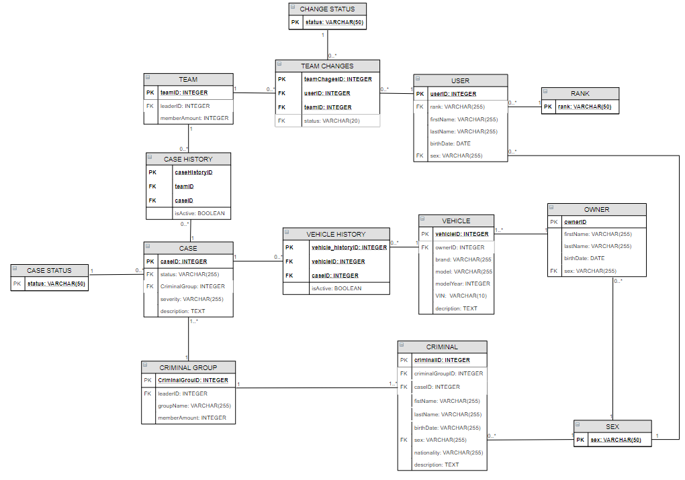

# Registry of stolen vehicles
## 2. kontrolný bod
Link na sql dump: https://drive.google.com/open?id=11kFTviK0Qr8h4oVN-4gl88G2Mv7maJYY

## About
This application will allow working on a vehicle theft criminal cases.

## Database diagram
### Logical model

### Physical

## Tables explained
**USER** - Holds all of the information about users of this application.

**TEAM** - Here are all of the police teams. There is one special team, unnassigned. All of the officers that do not belong to any team will be linked to this particular one.

**CASE** - A table that hold all information about a particular case. Important links are to the police team that is working in a particular case and a link to crimminal group that has caused this case

**VEHICLE** - Here all of the records of stolen vehicles. Each vehicle will be linked to a particular case.

**CASE HISTORY** - A table that holds information about changes to a particular case. 

**CRIMINAL GROUP** - Here are all of the criminal groups. This table will include organized crime groups and information about them. There will also be a special group, unnassigned. All of the criminals that are not a member of any particular group will be linked to this one.

**CRIMINAL** - A table with records on all registered crimminals, each will be linked to a particular criminal 
group that they belong to.

## TODO
### Assignment

 - [ ] View all entries
 - [ ] View details of specific entry
 - [ ] Creating new entry
 - [ ]  Updating existing entry
 - [ ] Deleting existing entry
 - [ ] Transactions
 - [ ] GUI

## Authors
Dominik Horváth
Dávid Drobný

